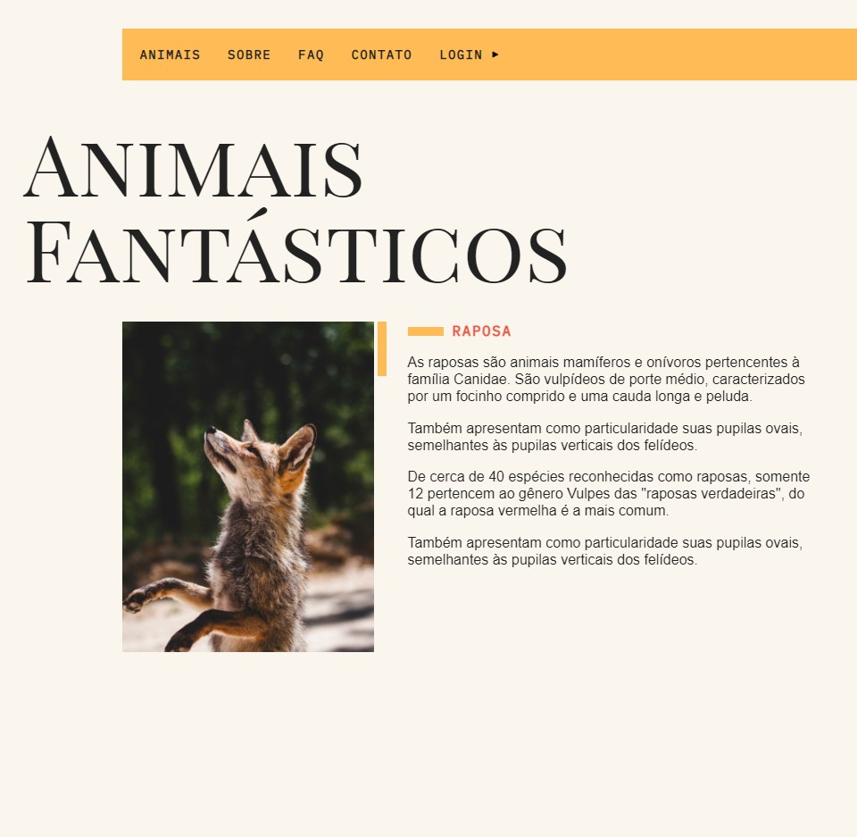

# [Animais Fantásticos](https://whoisangelo.github.io/animais-fantasticos/)

<h1>
    
</h1>

## :memo: Sobre

O projeto **Animais Fantásticos** é um website que foi criado dentro do curso **JavaScript Completo ES6+** da [Origamid](https://www.origamid.com/curso/javascript-completo-es6) com o intuito de botarmos em prática todo conteúdo estudado durante as aulas.

---

## :rocket: Tecnologias Utilizadas

O projeto foi desenvolvido utilizando as seguintes tecnologias:

- HTML5
- CSS3
- JAVASCRIPT
